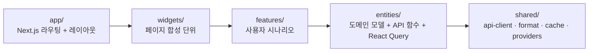
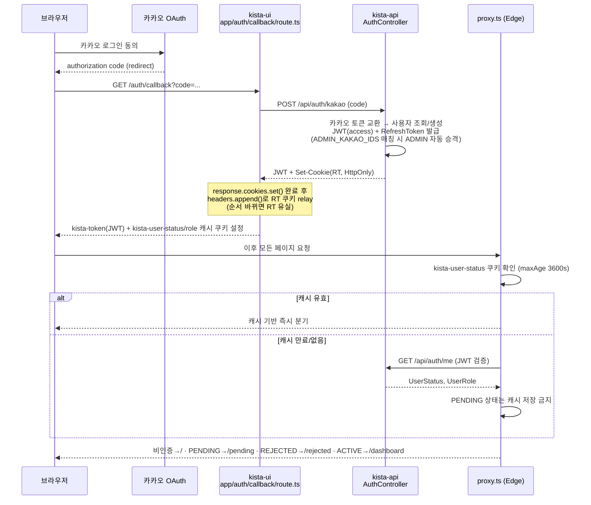
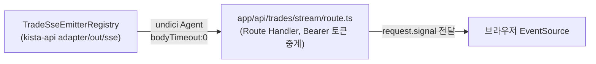

# kista-ui

KISTA — 한국투자증권(KIS)·토스증권 API 기반 해외주식 자동 분할매매 SaaS의 프론트엔드.
백엔드는 별도 저장소 [`kista-api`](../kista-api)(Java 21 + Spring Boot 3, Fly.io)와 연동한다.
두 저장소를 아우르는 전체 시스템 구성·배포·계약 동기화는 [`../ARCHITECTURE.md`](../ARCHITECTURE.md) 참고.

## 기술 스택

Next.js 16 (App Router, Turbopack) · TypeScript · Tailwind CSS 4 · shadcn/ui · React Query 5 · Firebase FCM

## 아키텍처

### 계층 구조 (FSD)

`entities/{domain}/api/`가 kista-api DTO를 소비하는 유일한 경계 — `normalizeXxx()` 함수로 KIS live 응답과 UI 타입 불일치를 흡수한다.

### 인증 흐름 (카카오 로그인 → JWT → 상태 라우팅)

### 실시간 알림 (SSE) 경로

브라우저 `EventSource`는 커스텀 헤더를 지원하지 않아 Route Handler가 Bearer 토큰을 붙여 중계한다.

## 배포

GitHub `main` push 시 Vercel 자동 배포. Docker 로컬 실행은 `docker compose up -d --build`.
