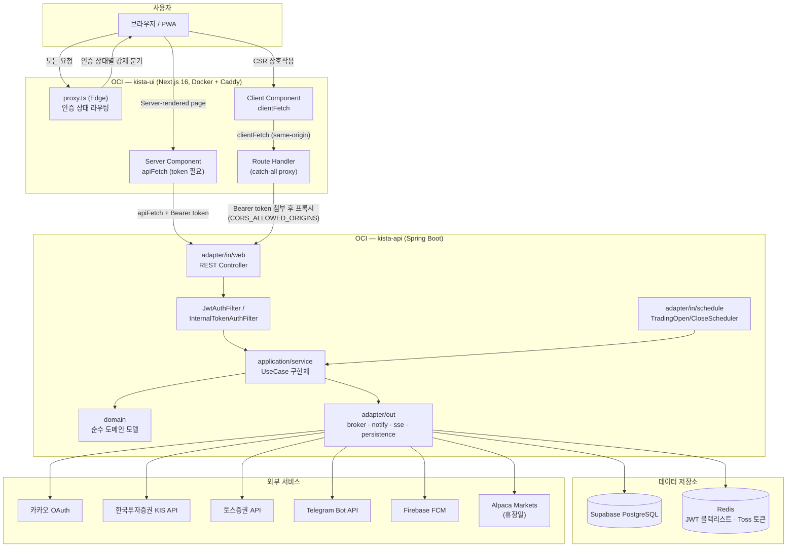
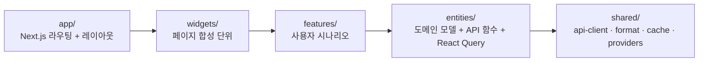
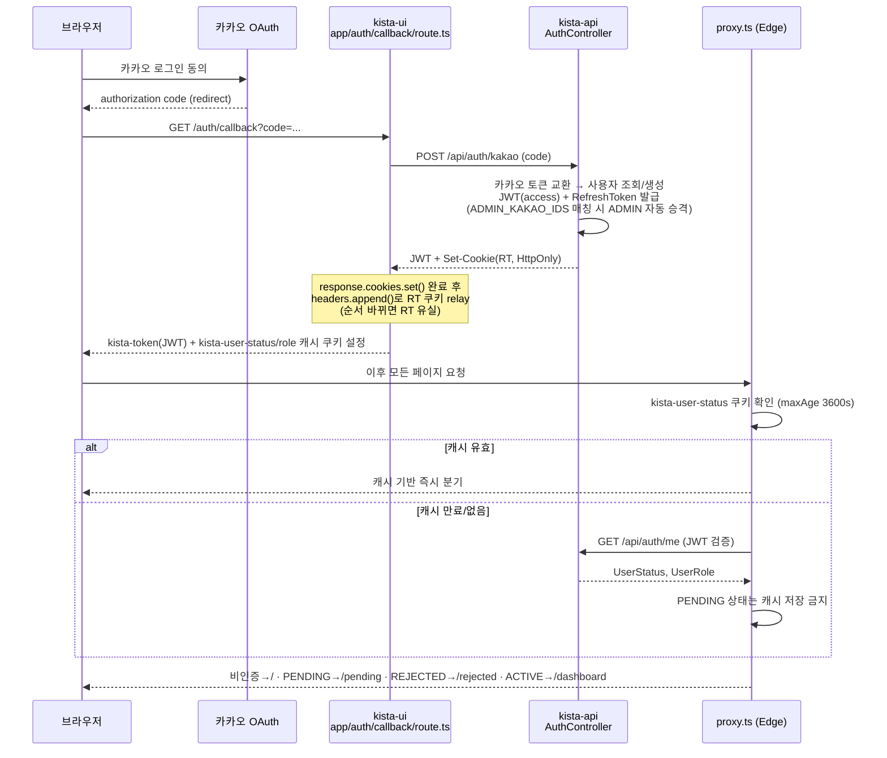
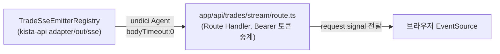

# kista-ui

KISTA(Key Investment Strategy & Trading Automation) — 정밀한 투자 전략을 기반으로 작동하는 다중 증권사 통합 자동매매 SaaS의 프론트엔드.
백엔드는 별도 저장소 [`kista-api`](https://github.com/narafu/kista-api)(Java 21 + Spring Boot 3, OCI)와 연동한다.

## 기술 스택

Next.js 16 (App Router, Turbopack) · TypeScript · Tailwind CSS 4 · shadcn/ui · React Query 5 · Firebase FCM

## 아키텍처

### 전체 시스템 구성

**핵심 원칙**: Client Component는 kista-api를 절대 직접 호출하지 않는다. 쿠키(HttpOnly RT, 인증 상태 캐시) 처리와 CORS 회피를 위해 항상 Next.js Route Handler를 경유한다. Server Component는 서버 간 호출이므로 `apiFetch`로 직접 호출하지만 이 역시 CORS 대상이다(`CORS_ALLOWED_ORIGINS`에 kista-ui 도메인 등록 필요 — kista-ui·kista-api가 서로 다른 OCI 인스턴스라 같은 VCN이어도 CORS 검증 대상).

### 계층 구조 (FSD)

`entities/{domain}/api/`가 kista-api DTO를 소비하는 유일한 경계 — `normalizeXxx()` 함수로 KIS live 응답과 UI 타입 불일치를 흡수한다.

### 인증 흐름 (카카오 로그인 → JWT → 상태 라우팅)

### 실시간 알림 (SSE) 경로

브라우저 `EventSource`는 커스텀 헤더를 지원하지 않아 Route Handler가 Bearer 토큰을 붙여 중계한다.

## 배포

GitHub `main` push 시 GitHub Actions가 arm64 Docker 이미지를 빌드해 OCI 인스턴스(`kista-ui-server`)에 배포한다 — 상세: `deploy/server/README.md`. Docker 로컬 실행은 `docker compose up -d --build`.

Vercel에서 운영하던 이전 배포(`narafus-projects/kista-ui`)는 2026-08-04 OCI 커트오버 검증 완료 후 프로젝트째 삭제했다.
