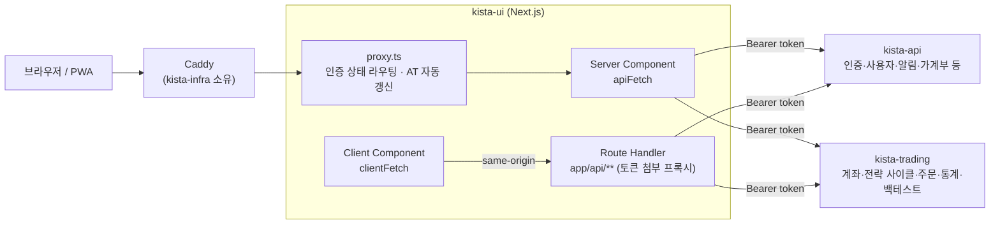
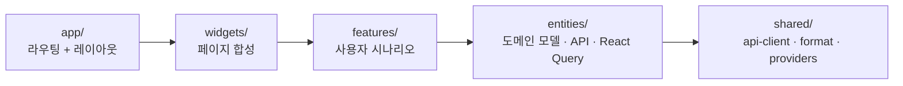
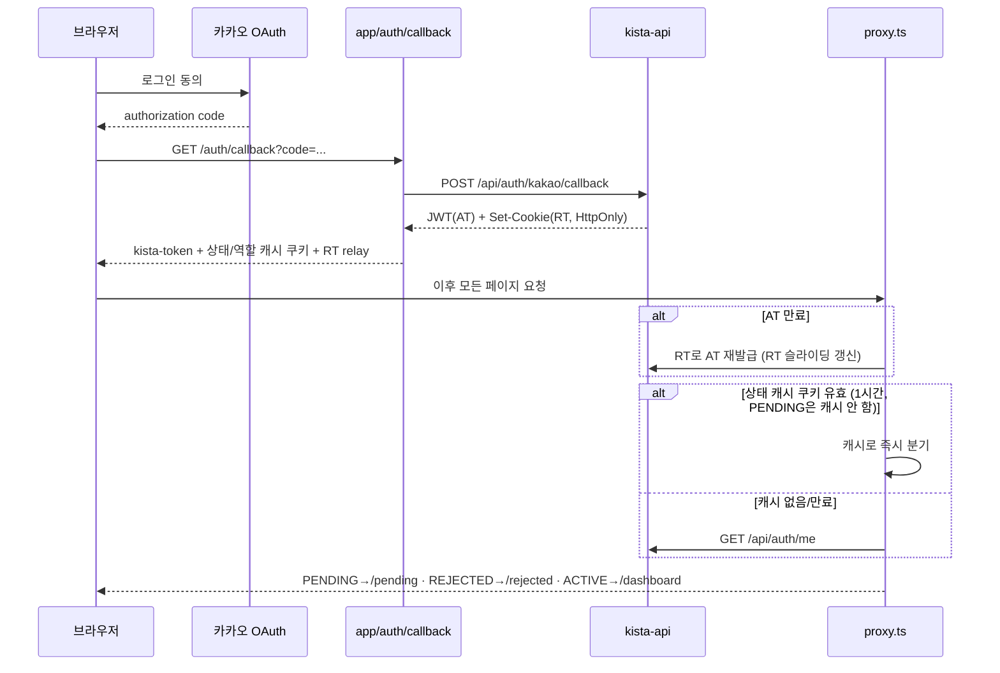

# kista-ui

[](https://github.com/narafu/kista-ui/actions/workflows/ci.yml)


KISTA(Key Investment Strategy & Trading Automation) — 정밀한 투자 전략을 기반으로 작동하는 다중 증권사 통합 자동매매 SaaS의 프론트엔드.
백엔드는 별도 저장소 [`kista-api`](https://github.com/narafu/kista-api)(Java 21 + Spring Boot 4)이며, 백엔드 내부 구조는 그쪽 README를 참고한다.

## 기술 스택

Next.js 16 (App Router, Turbopack) · React 19 · TypeScript · Tailwind CSS 4 · shadcn/ui · React Query 5 · Firebase FCM

## 로컬 개발

```bash
cp .env.example .env.local   # 값 채우기 (API_BASE_URL / TRADING_API_BASE_URL 등)
npm install
npm run dev                  # http://localhost:3000
```

| 명령 | 용도 |
|---|---|
| `npm run typecheck` · `npm run lint` | 기본 검증 (lint 0 errors 유지) |
| `npm run test:run` | Vitest 단위 테스트 |
| `npm run gen:types` | `openapi.json` → `shared/lib/api-types.ts` 재생성 |

전체 스크립트는 `package.json`, 작업 규칙은 `CLAUDE.md` · `docs/agents/` 참고.

## 아키텍처

### 요청 경로


```mermaid
graph LR
    Browser["브라우저 / PWA"]
    Caddy["Caddy<br/>(kista-infra 소유)"]

    subgraph UI["kista-ui (Next.js)"]
        Proxy["proxy.ts<br/>인증 상태 라우팅 · AT 자동 갱신"]
        RSC["Server Component<br/>apiFetch"]
        RH["Route Handler<br/>app/api/** (토큰 첨부 프록시)"]
        CC["Client Component<br/>clientFetch"]
    end

    API["kista-api<br/>인증·사용자·알림·가계부 등"]
    Trading["kista-trading<br/>계좌·전략 사이클·주문·통계·백테스트"]

    Browser --> Caddy --> Proxy
    Proxy --> RSC
    CC -->|"same-origin"| RH
    RSC -->|"Bearer token"| API & Trading
    RH -->|"Bearer token"| API & Trading
```

- **Client Component는 백엔드를 직접 호출하지 않는다.** HttpOnly 쿠키(토큰) 처리와 CORS 회피를 위해 항상 Route Handler를 경유한다.
- 백엔드는 프로세스가 둘이다. 호출 경로(prefix)에 따라 `kista-api`(`API_BASE_URL`) 또는 `kista-trading`(`TRADING_API_BASE_URL`)으로 보낸다 — `shared/lib/api-client`, `shared/lib/proxy/createProxyRoute.ts`가 분기 SSOT.
- Server Component 호출도 서버 간 요청이라 CORS 대상이다 (`CORS_ALLOWED_ORIGINS`, 상세 → `docs/agents/deployment.md`).

### 계층 구조 (FSD)


```mermaid
graph LR
    app["app/<br/>라우팅 + 레이아웃"] --> widgets["widgets/<br/>페이지 합성"] --> features["features/<br/>사용자 시나리오"] --> entities["entities/<br/>도메인 모델 · API · React Query"] --> shared["shared/<br/>api-client · format · providers"]
```

단방향 의존만 허용하고 같은 계층끼리 import하지 않는다. 백엔드 DTO는 `entities/{domain}/api/`에서만 소비한다.

### 인증 흐름


```mermaid
sequenceDiagram
    participant B as 브라우저
    participant K as 카카오 OAuth
    participant CB as app/auth/callback
    participant API as kista-api
    participant P as proxy.ts

    B->>K: 로그인 동의
    K-->>B: authorization code
    B->>CB: GET /auth/callback?code=...
    CB->>API: POST /api/auth/kakao/callback
    API-->>CB: JWT(AT) + Set-Cookie(RT, HttpOnly)
    CB-->>B: kista-token + 상태/역할 캐시 쿠키 + RT relay
    B->>P: 이후 모든 페이지 요청
    alt AT 만료
        P->>API: RT로 AT 재발급 (RT 슬라이딩 갱신)
    end
    alt 상태 캐시 쿠키 유효 (1시간, PENDING은 캐시 안 함)
        P->>P: 캐시로 즉시 분기
    else 캐시 없음/만료
        P->>API: GET /api/auth/me
    end
    P-->>B: PENDING→/pending · REJECTED→/rejected · ACTIVE→/dashboard
```

비인증 사용자는 `/dashboard` 등 비보호 경로만 접근할 수 있고, 보호 경로(`/accounts`·`/strategies`·`/stats`·`/settings`·`/finance`)는 `/login`으로 보낸다.

### 실시간 체결 알림 (SSE)

브라우저 `EventSource`는 커스텀 헤더를 못 붙이므로 `app/api/trades/stream/route.ts`가 Bearer 토큰을 붙여 kista-api SSE를 중계한다 (undici `bodyTimeout: 0`, `request.signal`로 연결 종료 전파).

## 배포

`main` push 시 GitHub Actions가 arm64 Docker 이미지를 빌드하고 `kista-infra`에 배포를 요청(dispatch)하면, kista-infra reconcile이 OCI 단일 인스턴스 `kista-api-server`에 적용한다. Caddy·PostgreSQL·Redis와 백엔드는 같은 인스턴스를 공유하며(kista-infra 소유), 이 레포는 `kista-ui` 컨테이너만 배포한다.

- 상세·롤백 절차: `deploy/server/README.md`
- `NEXT_PUBLIC_*`는 빌드 타임 인라인 — 값은 `.env.production.public`(공개값, 평문 커밋)
- 로컬 Docker 실행: `docker compose up -d --build`
